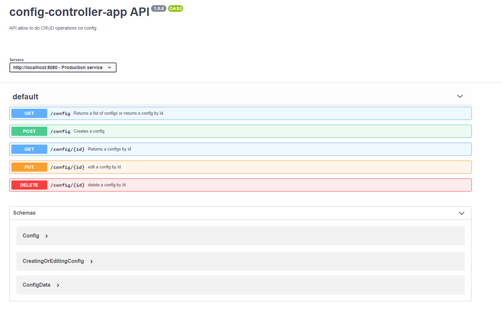

# Вопросы для разогрева #
1. На мой взгляд, самая интерсная задача в программировании, которую мне приходилось решать возникла в процессе написания дипломной работы(так как я системный аналитик и не пишу код, выполняя свои рабочие обязанности). Нужно было сделать сайт, на котором можно онлайн редактировать 3D модель предмета одежды. 
2. Ответ на этот вопрос связан с предыдущим, так как сделать сайт таким как я хотела не удалось. Я искала и пробовала большое колличество библиотек, которые можно было бы использовать, но ни одну библиотеку так и не удалось гладко импортировать в проект. В конечном итоге вместо 3D модели я сделала несколько 2D моделей в разных проекциях.
3. Будучи сотрудником Cloud я очень хочу выучить goLang, чтобы лучше понимать разработчиков и без затруднений читать код во внтутренних репозиториях


# Задание 2 #
сервис реализован на python с применением фреймворка Django + REST framework.
В качестве базы данных выбрана Postgresql

## Deploy ##
приложение доступно по адресу: https://config-controller.herokuapp.com/config


## Схема данных ##

| Название поля       | Тип данных               | 
| ------------- |:------------------:| 
| id     | int unique not null autogenerated    |
| service     | text unique | 
| data  | jsonb       |  
| version  | numeric(5, 2)         |
| created_at  | datetime         |
| updated_at  | datetime         |

## swagger спецификация ##
по ссылке: по ссылке: 



## Тестовый пример использования ##
### Получение всех конфигов ###
````
GET http://127.0.0.1:8000/config
````
Тело запроса:
````
-
````
Код ответа: 200

Тело ответа:
````
[
    {
        "id": 21,
        "service": "vmware",
        "data": [
            {
                "key1": "value1"
            },
            {
                "key2": "value2"
            }
        ],
        "version": "1.00"
    },
    {
        "id": 22,
        "service": "s3",
        "data": [
            {
                "key1": "value1"
            },
            {
                "key2": "value2"
            }
        ],
        "version": "1.00"
    }
]
````
### Получение конфига по сервису ###
````
GET http://127.0.0.1:8000/config?service=s3
````
Тело запроса:
````
-
````
Код ответа: 200

Тело ответа:
````
[
    {
        "id": 22,
        "service": "s3",
        "data": [
            {
                "key1": "value1"
            },
            {
                "key2": "value2"
            }
        ],
        "version": "1.00"
    }
]
````
### Получение конфига по идентификатору###
````
GET http://127.0.0.1:8000/config/21
````
Тело запроса:
````
-
````
Код ответа: 200

Тело ответа:
````
{
    "id": 21,
    "service": "vmware",
    "data": [
        {
            "key1": "value1"
        },
        {
            "key2": "value2"
        }
    ],
    "version": "1.00"
}
````
### Создание конфига ###
````
POST http://127.0.0.1:8000/config
````
Тело запроса:
````
{
        "service": "k8s",
        "data": [{"key1":"value1"}]
}
````
Код ответа: 201

Тело ответа:
````
{
    "id": 20,
    "service": "k8s",
    "data": [
        {
            "key1": "value1"
        }
    ],
    "version": "1.00"
}
````

### Редактирование конфига ###
````
PUT http://127.0.0.1:8000/config/20
````
Тело запроса:
````
{
        "service": null,
        "data": [{"key1":"value1"}]
}
````
Код ответа: 200

Тело ответа:
````
{
    "id": 20,
    "service": null,
    "data": [
        {
            "key1": "value1"
        }
    ],
    "version": "1.01"
}
````

### Удаление конфига ###
````
DELETE http://127.0.0.1:8000/config/20
````
Тело запроса:
````
-
````
Код ответа: 204

Тело ответа:
````
-
````


